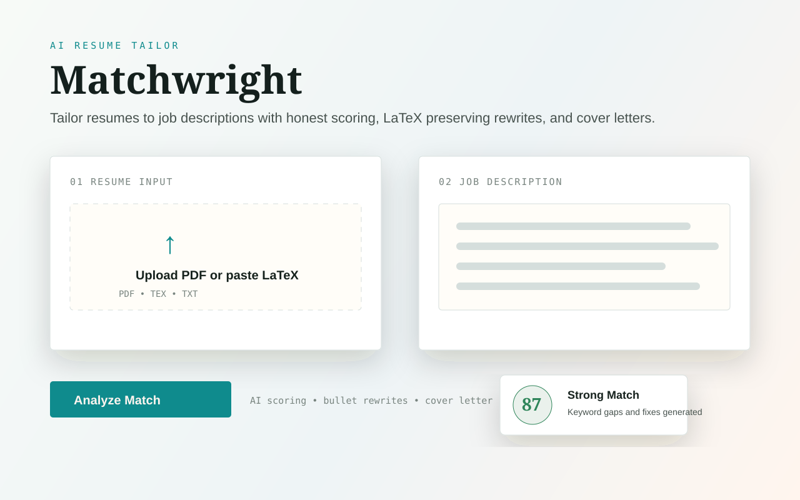

# Matchwright



Matchwright is an AI powered resume tailoring app that helps users compare a resume against a job description, identify missing keywords, rewrite relevant bullets, and generate polished application materials without inventing experience.

The project is built around a practical recruiting workflow: upload or paste a resume, paste a job description, receive a match analysis, then generate a targeted resume and cover letter.

## Core Features

- Resume to job description match scoring
- AI generated bullet rewrites using the Google XYZ style
- LaTeX aware resume tailoring for users who want to preserve formatting
- PDF resume reading when LaTeX source is not available
- Tailored resume, cover letter, and export focused workflow
- Server side OpenAI proxy so API keys are never exposed in browser JavaScript
- Safety guardrails that tell the model not to invent employers, dates, degrees, tools, certifications, or metrics

## Why This Project Matters

Most students apply with generic resumes. Matchwright turns resume tailoring into a repeatable software workflow by combining document parsing, prompt engineering, frontend UX, and server side model calls.

## Tech Stack

| Area | Tools |
|---|---|
| Frontend | Vite, React |
| Backend | Serverless API route |
| AI | OpenAI API |
| Documents | PDF input, LaTeX input/output |
| Deployment | Vercel ready |

## Local Setup

```bash
npm install
cp .env.example .env
npm run dev
```

Add your API key:

```text
OPENAI_API_KEY=your_key_here
```

Optional model setting:

```text
OPENAI_MODEL=gpt-5.4-mini
```

## Deploy To Vercel

1. Push the repository to GitHub.
2. Import it into Vercel.
3. Add environment variables:
   - `OPENAI_API_KEY`
   - `OPENAI_MODEL` optional
4. Deploy.

Vercel uses `npm run build`, the `dist` output folder, and `api/openai.js` as the serverless OpenAI proxy.

## Product Notes

Before sharing the app publicly, add authentication, usage limits, rate limiting, or a payment system. Without those controls, public users could trigger API spend through the deployed endpoint.

## Recruiter Notes

This project demonstrates practical AI product development, frontend engineering, API design, prompt safety, document handling, and deployment awareness. It is strongest as a portfolio project because it solves a real student and job seeker problem.

## Future Improvements

- Add user authentication
- Add rate limiting and usage quotas
- Add saved resume versions
- Add keyword gap explanations
- Add side by side diff view for generated resume changes
- Add automated tests for prompt and API behavior
